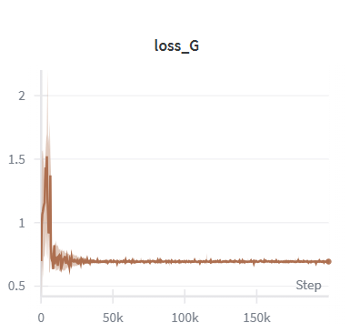
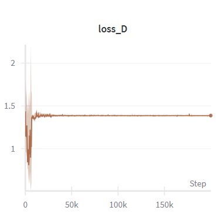
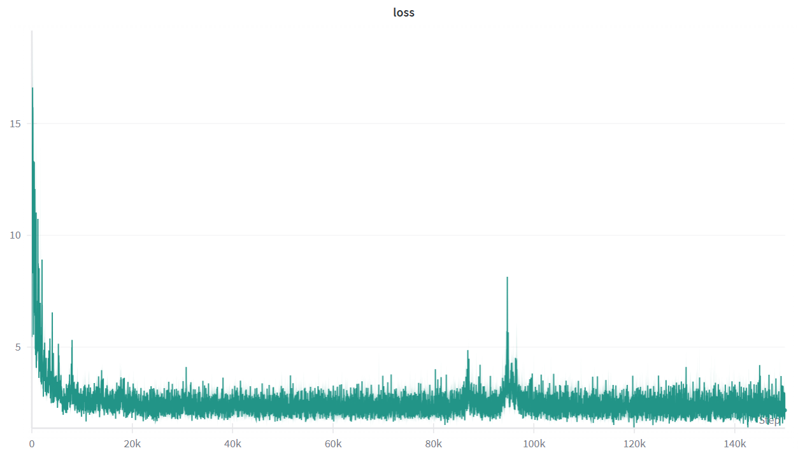
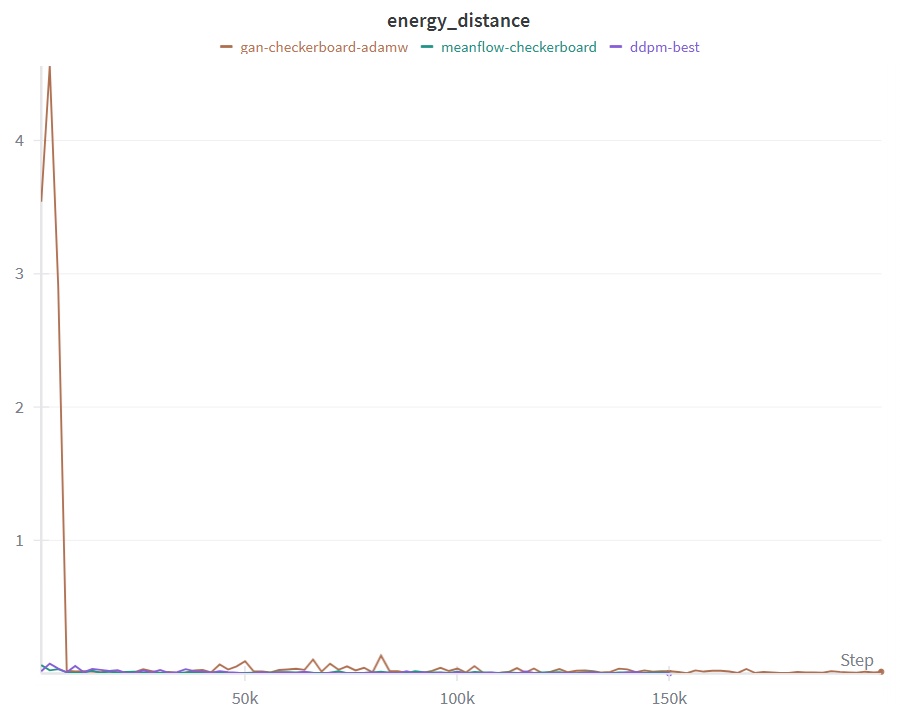
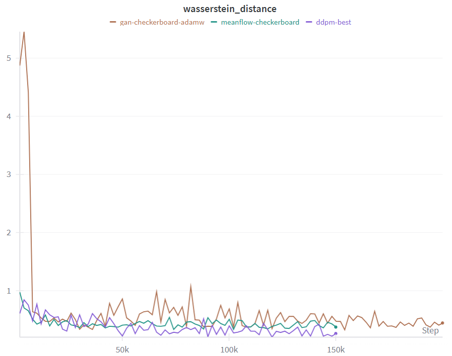
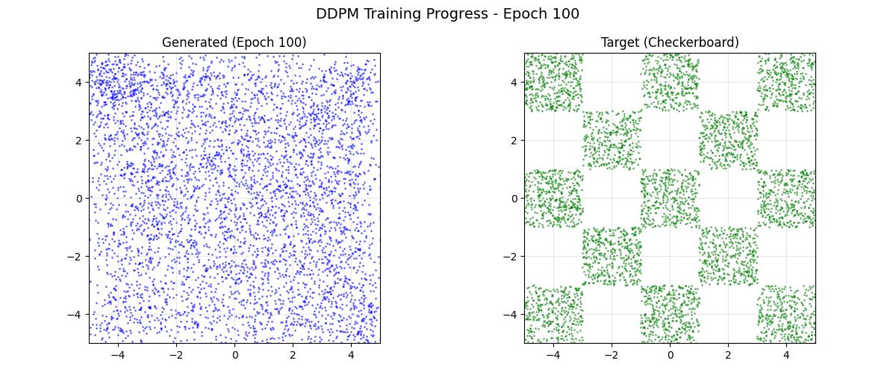
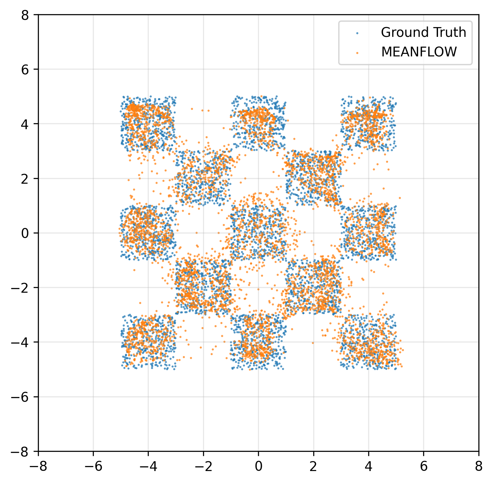

[](https://classroom.github.com/a/UPVOpvc0)
# ML Assignment 4: Generative Models

This repository contains the implementation for Assignment 4 of the Machine Learning (CSIE5043) course, Fall 2025, at National Taiwan University. In this assignment, we study generative modeling on 2D synthetic datasets by implementing and comparing three representative model families: GAN, DDPM, and DDIM. The primary objective is to train these models on the checkerboard dataset and evaluate their ability to learn and reproduce the target distribution. Implementing MeanFlow is optional and will be counted as extra credit.


## 🧩 Setup
To install all required dependencies, simply run:
```
uv sync
```
> [!TIP]
> Ensure that uv is installed beforehand: `pip install uv`
If you need additional packages, please obtain approval from the TA in advance.


## 🏋️ Training
To start training:
```bash
# Train DDPM (default)
uv run train.py -m ddpm

# Train GAN
uv run train.py -m gan

# Train MeanFlow (bonus)
uv run train.py -m meanflow
```

Training configurations are defined in `configs/` directory:
- `configs/ddpm.yaml` - DDPM configuration (7500 epochs, sinusoidal time embedding)
- `configs/gan.yaml` - GAN configuration (10000 epochs)
- `configs/meanflow.yaml` - MeanFlow configuration (7500 epochs, Huber loss)

> [!NOTE]
> The default DDPM configuration uses **Sinusoidal Positional Embedding**, which produces the best model for DDIM sampling. The trained model is saved to `checkpoints/diffusion.pth` and can be used directly for both DDPM and DDIM inference.

> [!TIP]
> To experiment with **Learned Embedding**, modify `configs/ddpm.yaml`:
> ```yaml
> model:
>   time_embed_type: "learned"  # Change from "sinusoidal" to "learned"
> ```


## 📦 Generating Submission
To generate predictions for submission:
```bash
# Problem 1: GAN
bash scripts/run_problem_1.sh

# Problem 2a: DDPM
bash scripts/run_problem_2a.sh

# Problem 2b: DDIM
bash scripts/run_problem_2b.sh

# Advanced (Bonus): MeanFlow
bash scripts/run_problem_adv.sh
```

Or run directly with Python:
```bash
uv run generate_sample.py -m gan       # Problem 1
uv run generate_sample.py -m ddpm      # Problem 2a
uv run generate_sample.py -m ddim      # Problem 2b
uv run generate_sample.py -m meanflow  # Advanced
```

Generated files are saved to `results/`:
- `{method}_generated_sample.npy` - Generated samples (5000 points)
- `{method}_submission.csv` - Submission file
- `{method}.png` - Visualization comparing generated vs target distribution


## 🔬 Running DDIM Experiments
To reproduce the DDIM ablation study results (different steps and η values):
```bash
uv run run_ddim_experiments.py
```

This script runs two experiments:
1. **Experiment 1: Different Denoising Steps** - Tests DDIM with 1000, 500, 100, 10, and 1 steps (η=1.0 fixed)
2. **Experiment 2: Different η Values** - Tests DDIM with η ∈ {0, 0.25, 0.5, 0.75, 1.0} (50 steps fixed)

Generated comparison plots are saved to:
- `results/ddim_steps_comparison.png` - ED/WD vs. denoising steps
- `results/ddim_eta_comparison.png` - ED/WD vs. η value

> [!NOTE]
> This script requires a trained DDPM model (`checkpoints/diffusion.pth`). Run `uv run train.py -m ddpm` first if the checkpoint doesn't exist.


## 🧪 Experiment Results

### Main Results
<table>
  <tr>
    <td>Methods</td>
    <td>#Step</td>
    <td>ED</td>
    <td>WD</td>
  </tr>
  <tr>
    <td>GAN</td>
    <td>1</td>
    <td>0.0127</td>
    <td>0.4700</td>
  </tr>
  <tr>
    <td>DDPM</td>
    <td>1000</td>
    <td>0.0025</td>
    <td>0.2941</td>
  </tr>
  <tr>
    <td>DDIM</td>
    <td>1000</td>
    <td>0.0025</td>
    <td>0.2940</td>
  </tr>
  <tr>
    <td>DDIM</td>
    <td>500</td>
    <td>0.0017</td>
    <td>0.2106</td>
  </tr>
  <tr>
    <td>DDIM</td>
    <td>100</td>
    <td>0.0013</td>
    <td>0.2129</td>
  </tr>
  <tr>
    <td>DDIM</td>
    <td>10</td>
    <td>0.0596</td>
    <td>0.8685</td>
  </tr>
  <tr>
    <td>DDIM</td>
    <td>1</td>
    <td>1.2627</td>
    <td>4.0667</td>
  </tr>
  <tr>
    <td>(MeanFlow)</td>
    <td>1</td>
    <td>0.0037</td>
    <td>0.3464</td>
  </tr>
</table>

> **Observation / Insight:** 
> 1. **Diffusion models outperform GAN**: DDPM achieves significantly lower ED (0.0025) compared to GAN (0.0127), demonstrating better distribution matching.
> 2. **DDIM achieves optimal performance at 100-500 steps**: The best ED (0.0013) is achieved at 100 steps, suggesting diminishing returns beyond this point.
> 3. **Quality degrades rapidly below 10 steps**: DDIM with 1 step shows poor performance (ED=1.2627), indicating insufficient denoising.
> 4. **MeanFlow achieves competitive 1-step generation**: With ED=0.0037, MeanFlow significantly outperforms both GAN (0.0127) and 1-step DDIM (1.2627) for single-step generation.


### Ablation Study

#### DDPM
#Step: 1000
<table>
  <tr>
    <td>Time Embedding</td>
    <td>ED</td>
    <td>WD</td>
  </tr>
  <tr>
    <td>Learned Embedding</td>
    <td>0.0052</td>
    <td>0.2980</td>
  </tr>
  <tr>
    <td>Sinusoidal Positional Embedding</td>
    <td>0.0025</td>
    <td>0.2941</td>
  </tr>
</table>

> **Observation / Insight:**
> Sinusoidal Positional Embedding outperforms Learned Embedding on both metrics (ED: 0.0025 vs 0.0052, WD: 0.2941 vs 0.2980). This suggests that the fixed frequency-based encoding provides better inductive bias for capturing temporal information in the diffusion process, while learned embeddings may require more training data or epochs to converge to similar performance.

#### DDIM
#Step: 50
<table>
  <tr>
    <td>eta</td>
    <td>ED</td>
    <td>WD</td>
  </tr>
  <tr>
    <td>0</td>
    <td>0.0112</td>
    <td>0.4737</td>
  </tr>
  <tr>
    <td>0.25</td>
    <td>0.0067</td>
    <td>0.3559</td>
  </tr>
  <tr>
    <td>0.5</td>
    <td>0.0068</td>
    <td>0.3559</td>
  </tr>
  <tr>
    <td>0.75</td>
    <td>0.0045</td>
    <td>0.3733</td>
  </tr>
  <tr>
    <td>1</td>
    <td>0.0046</td>
    <td>0.3226</td>
  </tr>
</table>

> **Observation / Insight:**
> 1. **Stochasticity improves multi-modal distribution learning**: Higher η values (0.75-1.0) achieve better ED (0.0045-0.0046) compared to deterministic sampling η=0 (0.0112).
> 2. **η=1 achieves the best Wasserstein Distance**: WD=0.3226 at η=1 outperforms all other η values, suggesting that DDPM-like stochastic sampling better captures the checkerboard's sharp boundaries.
> 3. **Deterministic DDIM (η=0) struggles with multi-modal distributions**: The higher ED at η=0 indicates that deterministic sampling may collapse modes in the checkerboard pattern.


### Learning Curve Analysis

In this section, you need to plot line charts for key metrics over time.

#### Training steps vs Training Loss

- GAN (Generator Loss):



- GAN (Discriminator Loss):



- DDPM:


- MeanFlow:



> **Observation / Insight:**
> 1. **GAN shows adversarial dynamics**: Generator and Discriminator losses oscillate as they compete, with the Discriminator typically maintaining lower loss as it learns to distinguish real from fake samples.
> 2. **DDPM exhibits stable convergence**: The MSE loss decreases smoothly and stabilizes, indicating consistent learning of the noise prediction task without the instability issues common in GANs.
> 3. **MeanFlow converges similarly to DDPM**: Using Huber loss with JVP-based training, MeanFlow shows stable convergence comparable to DDPM.

#### Per 100 epochs vs Energy Distance



> **Observation / Insight:**
> DDPM and MeanFlow achieve lower Energy Distance more quickly than GAN. DDPM converges to the lowest ED, while MeanFlow achieves competitive performance with its 1-NFE architecture.

#### Per 100 epochs vs 2-Wasserstein Distance



> **Observation / Insight:**
> Similar to Energy Distance, diffusion-based methods (DDPM, MeanFlow) outperform GAN in Wasserstein Distance. The gap between GAN and diffusion models highlights the advantage of iterative denoising for capturing complex multi-modal distributions.


### Visualization

In this section, you will visualize the learned distributions through GIF animations and figures.

#### GIF of training progression (learned distribution over epochs)

- GAN:


- DDPM:



- MeanFlow:


> **Observation / Insight:**
> 1. **GAN learns the general structure quickly** but may exhibit mode oscillation during training, with some regions of the checkerboard being captured better than others at different epochs.
> 2. **DDPM shows gradual refinement**: Starting from random noise, DDPM progressively learns to generate cleaner checkerboard patterns, with boundaries becoming sharper over epochs.
> 3. **MeanFlow achieves rapid convergence**: Leveraging flow matching, MeanFlow quickly learns to generate high-quality samples with its 1-NFE architecture.

#### Figure of final learned distribution

- GAN:


- DDPM:


- DDIM:


- MeanFlow:



> **Observation / Insight:**
> 1. **All models successfully learn the checkerboard pattern**, demonstrating the effectiveness of generative modeling on 2D synthetic data.
> 2. **DDPM/DDIM produce sharper boundaries** compared to GAN, which may show slightly more scattered points near the edges.
> 3. **DDIM with accelerated sampling** maintains comparable quality to DDPM while using fewer denoising steps.
> 4. **MeanFlow achieves competitive quality with 1-step generation**, making it highly efficient for real-time applications.


📚 Notes
- Ensure your results are reproducible by fixing random seeds and clearly specifying configurations.
- All figures, tables, and experiment descriptions should be self-contained and interpretable without referring to external materials.
- Please maintain clarity and organization throughout your report and code structure.
